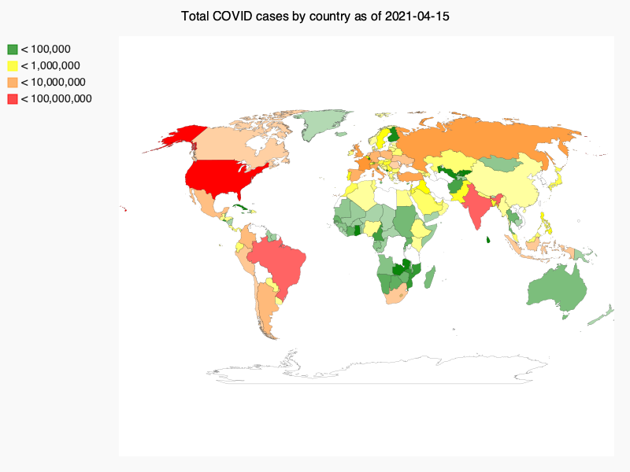

# covid-visualization
A visualization for COVID infection rate data, by country

This visualization pulls the most up-to-date COVID infection rate data (derived from Our World in Code (OWID) open source data) to create an interactive visualization on the Pygal World() chart. The graphic includes embedded hyperlinks from each country on the map to pull Google search results for that country's COVID infection rates. 

Although the original code (commented out in COVID_19_vis_final.py) allows for the most recent info to be pulled from an updated CSV file, it is saved here as today's date with matching OWID data for proof of concept. 

